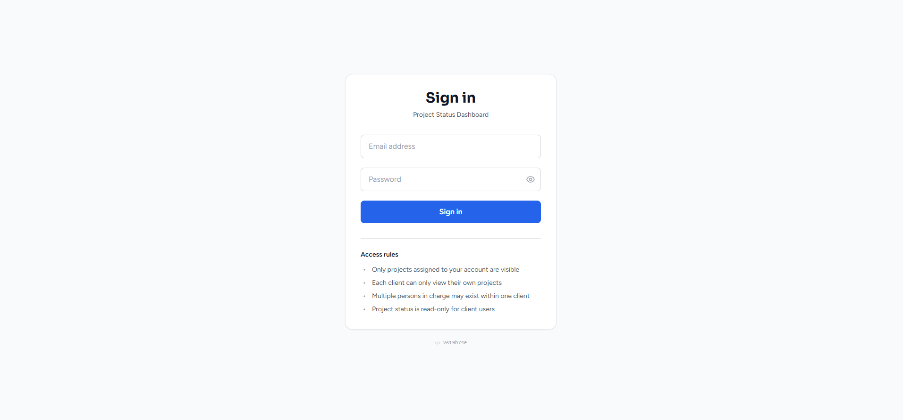
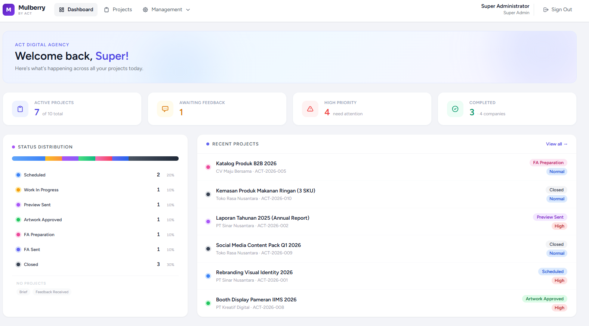
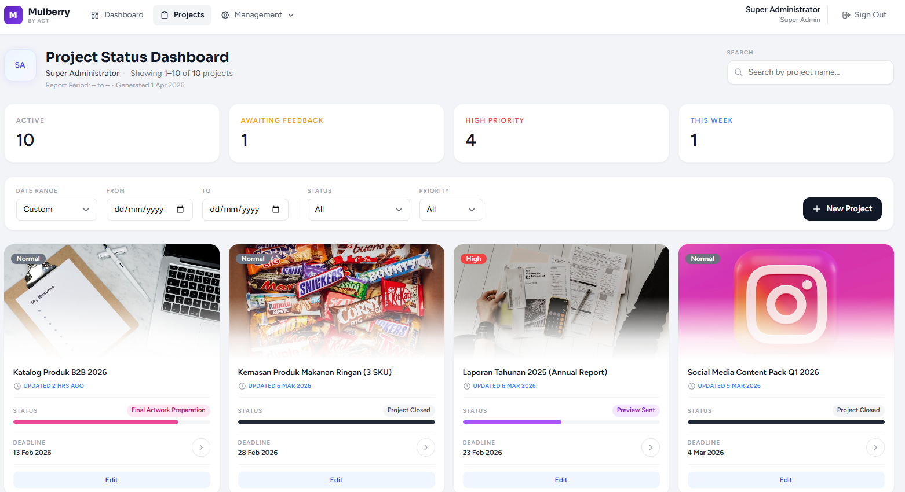
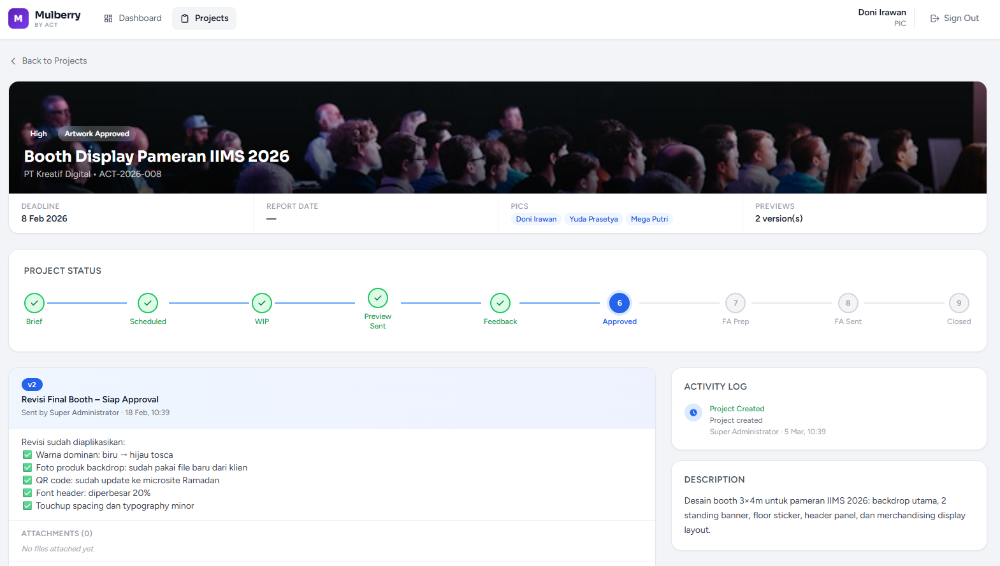
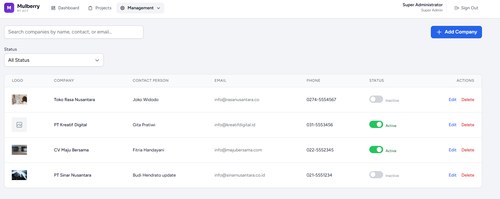
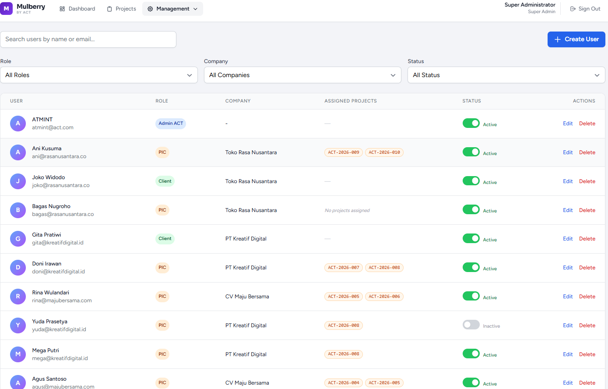

<div align="center">
  
  
</div>

<h1 align="center">Mulberry Project Tracking System</h1>

<p align="center">
  A modern, efficient Project Tracking and Management Dashboard built with <strong>Laravel 11</strong>, <strong>Vue.js 3</strong> (via Inertia.js), and <strong>Tailwind CSS</strong>. Tailored for creative agencies to manage clients, track project progress, and streamline feedback loops.
</p>

---

## 📸 Screenshots

| Login Page | Admin Dashboard |
| :---: | :---: |
|  |  |

| Projects List | Project Detail & Feedback |
| :---: | :---: |
|  |  |

| Companies Management | User Management |
| :---: | :---: |
|  |  |

## ✨ Features

- **Role-Based Access Control (RBAC):** Distinct interfaces and abilities for `Super Administrator`, `Admin ACT`, `PIC` (Person In Charge), and `Client`.
- **Project Lifecycle Tracking:** Visual progress bars pushing projects from *Brief* to *Closed* with specific statuses (e.g., Work In Progress, Preview Sent, Feedback Received, Artwork Approved).
- **Interactive Feedback System:** Two-way feedback loop between internal team and clients, including file attachments and previews.
- **Client & User Management:** Organize projects by Companies and safely assign specific client users to oversee only their respective projects.
- **Modern UI/UX:** Responsive, dynamic dashboard with real-time statistics, smooth animations, and comprehensive activity logging.

## 🛠️ Tech Stack

- **Backend:** [Laravel 11](https://laravel.com/) (PHP 8.2)
- **Frontend:** [Vue 3](https://vuejs.org/) (Composition API)
- **Routing/Bridge:** [Inertia.js](https://inertiajs.com/)
- **Styling:** [Tailwind CSS 3](https://tailwindcss.com/)
- **Database:** SQLite (Default for local development)

## 🚀 How to Run Locally

Follow these steps to set up the application on your local machine.

### Prerequisites
- PHP >= 8.2
- Composer
- Node.js & npm
- Git

### Installation Steps

1. **Clone the repository**
   ```bash
   git clone <your-repo-url> mulberry
   cd mulberry
   ```

2. **Install PHP Dependencies**
   ```bash
   composer install
   ```

3. **Install Node.js Dependencies**
   ```bash
   npm install
   ```

4. **Environment Setup**
   Copy the example `.env` file and generate a new application key.
   ```bash
   cp .env.example .env
   php artisan key:generate
   ```
   > **Note:** The default database in `.env` is set to `sqlite`.

5. **Set up the Database**
   Create the SQLite file and run migrations along with seeders.
   ```bash
   touch database/database.sqlite
   php artisan migrate:fresh --seed
   ```
   *The seeder will automatically generate Dummy Data including sample Projects, Companies, and admin/client accounts.*

6. **Start the Development Servers**
   You need to run two processes simultaneously in separate terminal windows.
   
   **Terminal 1: Start Laravel Backend**
   ```bash
   php artisan serve
   ```
   
   **Terminal 2: Start Vite Frontend (for Vue/Tailwind compilation)**
   ```bash
   npm run dev
   ```

7. **Access the Application**
   Open your browser and navigate to: `http://localhost:8000`

### Default Login Accounts

If you ran the seeder (`--seed`), you can log in using the accounts generated by `DemoSeeder.php` or `DatabaseSeeder.php`. Typically, check your seeders or register a new Super Admin account to access all features.

## 📡 Deployment (CI/CD)

This project includes a built-in automated deployment script (`public/deploy-webhook.php`) and a GitHub Actions workflow (`.github/workflows/deploy.yml`).

When code is pushed or tagged on GitHub, it transfers files via FTP, handles cache clearing, updates the application version dynamically from Git tags, and optimizes views automatically.
